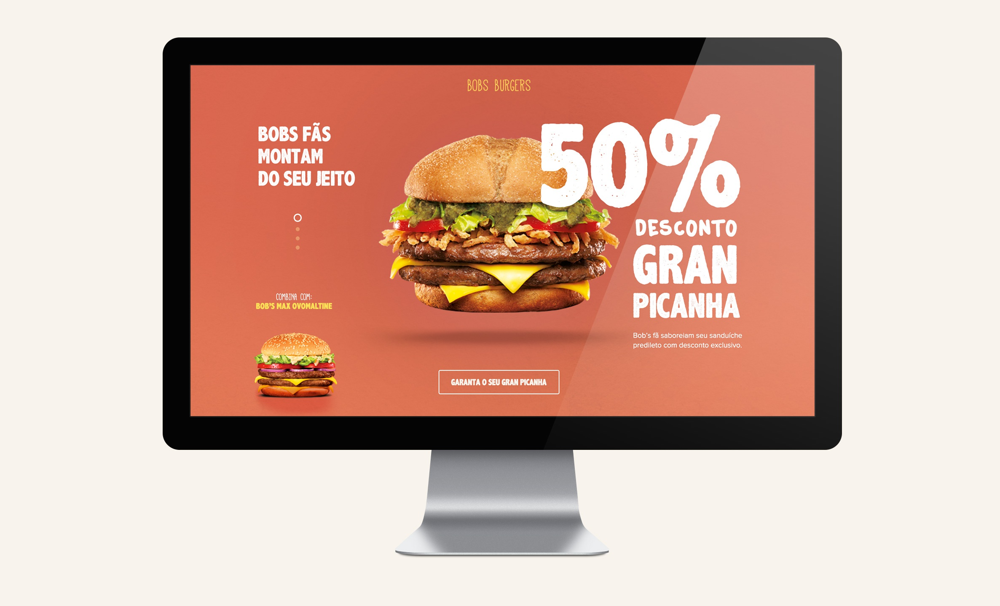

# On s'approche du BURGER menu 🍔

**Vous allez dévorer cette maquette sans prendre un kilo 🤣**

Je vais vous avouer quelque chose, **j'adore les burgers 🤪**. Rien que d'en parler ça me donne faim.  
En _faim_ bref, ça me chauffe tout ça 🔥  
Une nouvelle idée émerge dans ma tête. Je veux développer une activité autour du 🍔.  
Mais avant celà j'aimerai une petite _Landing Page_ et ça tombe bien je connais une superbe équipe de développeur.se.s pour mettre ça en place.

Votre mission ~~si vous l'acceptez~~ intégrer la maquette fournie dans ce projet en utilisant vos supers pouvoirs CSS ([A game for learning CSS flexbox](https://flexboxfroggy.com/#fr)) mais aussi les bonnes pratiques du Web.

Ressources : [burger](https://www.pngwing.com/en/free-png-bvsyq), [typographie](https://fonts.google.com/specimen/Balsamiq+Sans?category=Sans+Serif,Display,Handwriting,Monospace) a intégrer

---

## Bonus

**Responsive Design**

**Le conseil gratuit :** ne manger pas trop vite, la digestion sera difficile 🍉 #manger5fruits&legumes

## Livrable

Un dépôt GitHub & un GitHub Page
